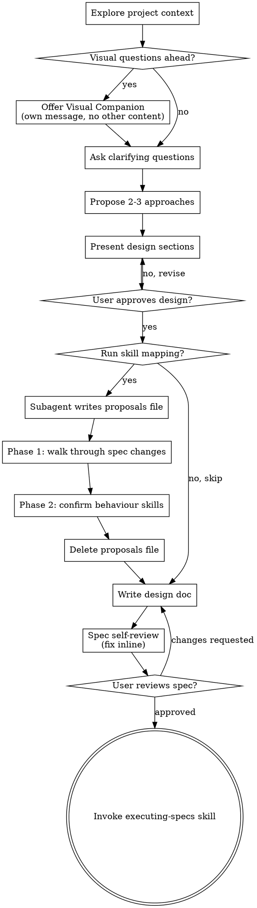

# Brainstorming Ideas Into Designs

Help turn ideas into fully formed designs and specs through natural collaborative dialogue.

Start by understanding the current project context, then ask questions one at a time to refine the idea. Once you understand what you're building, present the design and get user approval.

<HARD-GATE>
Do NOT invoke any implementation skill, write any code, scaffold any project, or take any implementation action until you have presented a design and the user has approved it. This applies to EVERY project regardless of perceived simplicity.
</HARD-GATE>

## Anti-Pattern: "This Is Too Simple To Need A Design"

Every project goes through this process. A todo list, a single-function utility, a config change — all of them. "Simple" projects are where unexamined assumptions cause the most wasted work. The design can be short (a few sentences for truly simple projects), but you MUST present it and get approval.

## Checklist

You MUST create a task for each of these items and complete them in order:

1. **Explore project context** — check files, docs, recent commits
2. **Offer visual companion** (if topic will involve visual questions) — this is its own message, not combined with a clarifying question. See the Visual Companion section below.
3. **Ask clarifying questions** — one at a time, understand purpose/constraints/success criteria
4. **Propose 2-3 approaches** — with trade-offs and your recommendation
5. **Present design** — in sections scaled to their complexity, get user approval after each section
6. **Confirm skill mapping** — ask the user whether to run skill mapping for this design; skip steps 7 and 8 if declined (see Confirm Skill Mapping below)
7. **Dispatch skill-mapping subagent to write proposals file** — only if the user confirmed at step 6: dispatch a general-purpose subagent on the approved design summary to write `docs/superpowers/specs/YYYY-MM-DD-<topic>-skill-proposals.md`, with Phase 1 (proposed spec changes) and Phase 2 (behaviour-driven skill candidates). Subagent returns only the file path (see Skill Mapping (Before Writing) below).
8. **Walk user through proposals** — only if the user confirmed at step 6: Phase 1 first (confirm/refine/reject per spec change, batched), then Phase 2 (opt-out batched for behaviour skills; the two defaults `superpowers:test-driven-development` and `superpowers:verification-before-completion` are always pre-accepted) (see Walk-through (Phase 1 + Phase 2) below).
9. **Write design doc** — save to `docs/superpowers/specs/YYYY-MM-DD-<topic>-design.md` with Phase 1 confirmations baked into the body and a `## Required Skills` block listing every Phase 2 skill the user did not opt out of. Delete the proposals file with `rm` before committing. Commit only the design spec.
10. **Spec self-review** — quick inline check for placeholders, contradictions, ambiguity, scope (see below)
11. **User reviews written spec** — ask user to review the spec file before proceeding
12. **Transition to implementation** — invoke executing-specs skill to implement the approved spec

## Process Flow

**The terminal state is invoking executing-specs.** Do NOT invoke any other implementation or domain skill instead. The ONLY skill you invoke after brainstorming is executing-specs.

## The Process

**Understanding the idea:**

- Check out the current project state first (files, docs, recent commits)
- Before asking detailed questions, assess scope: if the request describes multiple independent subsystems (e.g., "build a platform with chat, file storage, billing, and analytics"), flag this immediately. Don't spend questions refining details of a project that needs to be decomposed first.
- If the project is too large for a single spec, help the user decompose into sub-projects: what are the independent pieces, how do they relate, what order should they be built? Then brainstorm the first sub-project through the normal design flow. Each sub-project gets its own spec → plan → implementation cycle.
- For appropriately-scoped projects, ask questions one at a time to refine the idea
- Prefer multiple choice questions when possible, but open-ended is fine too
- Only one question per message - if a topic needs more exploration, break it into multiple questions
- Focus on understanding: purpose, constraints, success criteria

**Exploring approaches:**

- Propose 2-3 different approaches with trade-offs
- Present options conversationally with your recommendation and reasoning
- Lead with your recommended option and explain why

**Presenting the design:**

- Once you believe you understand what you're building, present the design
- Scale each section to its complexity: a few sentences if straightforward, up to 200-300 words if nuanced
- Ask after each section whether it looks right so far
- Cover: architecture, components, data flow, error handling, testing
- Be ready to go back and clarify if something doesn't make sense

**Design for isolation and clarity:**

- Break the system into smaller units that each have one clear purpose, communicate through well-defined interfaces, and can be understood and tested independently
- For each unit, you should be able to answer: what does it do, how do you use it, and what does it depend on?
- Can someone understand what a unit does without reading its internals? Can you change the internals without breaking consumers? If not, the boundaries need work.
- Smaller, well-bounded units are also easier for you to work with - you reason better about code you can hold in context at once, and your edits are more reliable when files are focused. When a file grows large, that's often a signal that it's doing too much.

**Working in existing codebases:**

- Explore the current structure before proposing changes. Follow existing patterns.
- Where existing code has problems that affect the work (e.g., a file that's grown too large, unclear boundaries, tangled responsibilities), include targeted improvements as part of the design - the way a good developer improves code they're working in.
- Don't propose unrelated refactoring. Stay focused on what serves the current goal.

## After the Design

**Confirm Skill Mapping:**
After the user verbally approves the design, ask whether to run skill mapping for this design before dispatching the mapping subagent. Skill mapping shapes the spec body and the `## Required Skills` block, but is overhead for small or throwaway changes.

Use `AskUserQuestion` with two options:

| Option | When to choose |
|---|---|
| **Yes, run skill mapping** | Non-trivial feature; you want skill expectations to shape the spec body and the `## Required Skills` block. |
| **Skip — small feature, write spec directly** | Small or throwaway change. TDD and verification-before-completion still apply at execution time — `executing-specs` invokes them via its own required workflow skills, independent of the spec's `## Required Skills` block. You only lose the spec-body refinement and the explicit Required Skills listing. |

Do not mark a default — the right answer depends on the design.

If the user picks **Skip**:
- Do not dispatch the mapping subagent.
- Do not run the re-investigation pass.
- Proceed directly to Documentation. The spec's `## Required Skills` block uses the zero-listable-skills fallback.

If the user picks **Yes**, continue with Skill Mapping (Before Writing) below.

**Skill Mapping (Before Writing):**
After the user confirms skill mapping at the Confirm Skill Mapping step and before writing the spec file, dispatch a `general-purpose` subagent to **write a proposals file** at `docs/superpowers/specs/YYYY-MM-DD-<topic>-skill-proposals.md`. The subagent returns only the file path. It writes no other file. The brainstormer determines the topic slug and date before dispatching, and passes the exact path in the prompt.

The proposals file structure the subagent MUST produce:

~~~markdown
# Skill-Driven Improvement Proposals — <topic>

> Generated by skill-mapping subagent on <YYYY-MM-DD>.
> Ephemeral — deleted after the walk-through. Source design summary follows.

## Design summary
<1–3 paragraph copy of the design summary the subagent received>

## Phase 1 — Proposed spec changes
(walked through first; each is confirm / refine / reject)

### 1. <Short title of the change>
**Change:** <concrete edit: where in the spec and the text to add or modify>
**Rationale:** <why this change improves the spec, in one or two sentences>
**From skill:** `<skill-name>`

### 2. ...

## Phase 2 — Behaviour-driven skill candidates
(asked after Phase 1; all pre-accepted, user opts out as needed)

### 1. `superpowers:test-driven-development`  [default]
**Why relevant:** <one sentence tying skill to the design>

### 2. `superpowers:verification-before-completion`  [default]
**Why relevant:** <one sentence tying skill to the design>

### 3. `<subagent candidate>`
**Why relevant:** <one sentence>

### 4. ...
~~~

The subagent prompt MUST include:

1. **The exact file path** to write the proposals file to (the parent constructs this from `docs/superpowers/specs/YYYY-MM-DD-<topic>-skill-proposals.md` using the slug and date it will also use for the design spec).
2. **The structured design summary**, composed inline by the brainstormer from the approved-design conversational state. Cover: goal, scope, approach, key constraints.
3. **The verbatim list of skill names + descriptions** visible in the parent session's `<system-reminder>` "available skills" block.
4. **Explicit instructions** the subagent must follow:
   - Read the design summary end-to-end.
   - Scan the provided skill list. For each skill, decide whether it applies to *this specific* implementation. Be conservative — prefer fewer, high-signal matches over a long list.
   - For each matched skill, assign exactly one **category**:
     - `spec-driving` — the skill's value can be captured by editing the spec (content, examples, structural requirements, acceptance items). After the change lands in the spec, the executor has no runtime job for the skill.
     - `behaviour-driving` — the skill governs *how* the executor works at runtime; its value cannot be captured by spec content.
   - **Strictness rule:** when a skill could plausibly be either category, default to `spec-driving`. Only assign `behaviour-driving` when the runtime discipline is the substantive value AND the spec cannot absorb it.
   - For each `spec-driving` skill: emit zero, one, or several **Phase 1 proposals** — each a concrete proposed edit to the spec (where to add or modify, what text). Skip the skill if it produces no proposed edit.
   - For each `behaviour-driving` skill: emit one **Phase 2 candidate** with a one-sentence `Why relevant`.
   - **Two hard-coded Phase 2 defaults** are always included in the Phase 2 list and marked `[default]` regardless of whether the subagent independently matched them: `superpowers:test-driven-development` and `superpowers:verification-before-completion`. The subagent writes both into the Phase 2 section as items 1 and 2.
   - Write the proposals file at the exact path provided. Return only the file path in the response. Do not edit any other file.
   - If no skills match beyond the two defaults, the Phase 1 section is "_No proposed spec changes._" and the Phase 2 section contains only the two defaults.

After the subagent returns the path, the brainstormer reads the file and runs the Walk-through (Phase 1 + Phase 2) described below.

Category reference table:

| Category | When to use | Example | Listed in `## Required Skills`? |
|---|---|---|---|
| **spec-driving** | The skill's value can be captured by editing the spec — content, examples, structural requirements, acceptance items. After the change lands, the executor has no runtime job. | "Collect comments on related pull requests and surface anything worth investigating" — the output becomes spec context; no runtime invocation needed. | No (changes are absorbed into the spec body via Phase 1) |
| **behaviour-driving** | The skill governs *how* the executor works at runtime. The spec body cannot absorb the value. | `superpowers:test-driven-development` — RED → GREEN → REFACTOR at runtime; spec doesn't restate the cycle. | Yes (added to the block in Phase 2, subject to user opt-out) |

**Re-investigation:**
For each `(skill, expectation)` pair returned by the Skill Mapping step, classify the expectation against the approved design into one of four states:

| State | Action |
|---|---|
| **Covered** | The design already specifies what the expectation asks for. Move on. |
| **Silent — technical only** | The expectation only refines HOW the work is verified or structured (verification evidence, testing detail, scope clarification, restructuring to a skill's expected template). Apply directly: incorporate the requirement into the spec content you are about to write. **No user question.** |
| **Silent — affects flow or business logic** | The expectation would change WHAT gets built, the task decomposition, external dependencies, or the order of work. Ask the user a clarifying question — one at a time, per the existing rule. |
| **Contradicts** | The design specifies something incompatible with the expectation. Surface the conflict; the user either revises the design or consciously waives the expectation. Record any waiver as a deliberate deviation in the spec body. |

Decision heuristic:

> Apply silently when the skill expectation only specifies HOW to verify or structure work the user already approved; ask when it would change WHAT gets built, the decomposition, or external dependencies.

Category does not affect re-investigation logic — every expectation, regardless of the source skill's category, is walked through the four-state table. Category is consulted only at the Documentation step to filter which skills appear in the `## Required Skills` block.

After the loop, if any silent changes were applied, surface a one-line transparency note to the user before writing the spec, e.g. "Applied 3 skill-driven refinements: enumerated evidence in Acceptance Criteria, added grep-check to Testing, tightened Scope to call out frontmatter integrity." This is a statement, not a question.

Skip the re-investigation pass entirely if the user declined skill mapping at the Confirm Skill Mapping step or if Skill Mapping returned no skills.

**Documentation:**

- Write the validated design (spec) to `docs/superpowers/specs/YYYY-MM-DD-<topic>-design.md`
  - (User preferences for spec location override this default)
- Use elements-of-style:writing-clearly-and-concisely skill if available
- Commit the design document to git

The spec body bakes in the skill-driven refinements applied during Re-investigation. The `## Required Skills` block at the top of the spec is written inline as part of this step.

**Filter rule for the `## Required Skills` block:** list *only* skills whose category (from Skill Mapping) is `behaviour-driving` or `spec-behaviour-driving`. Skills categorized `spec-driving` are excluded — the executor has no runtime job for them, and their contribution is already in the spec body. Do not list spec-driving skills in any auxiliary section either; the spec is silent about them.

The block format:

~~~
## Required Skills

> Before starting implementation, invoke each skill in **Required Skills** via the Skill tool.

- **<skill name>** — <one-sentence why_relevant>
~~~

**Zero-listable-skills fallback:** if after filtering the block would contain no entries (every matched skill was `spec-driving`, Skill Mapping returned an empty list, or the user declined skill mapping at the Confirm Skill Mapping step), the block becomes:

~~~
## Required Skills

_No specific skills required beyond defaults._
~~~

No separate post-write skill mapping pass.

**Spec Self-Review:**
After writing the spec document, look at it with fresh eyes:

1. **Placeholder scan:** Any "TBD", "TODO", incomplete sections, or vague requirements? Fix them.
2. **Internal consistency:** Do any sections contradict each other? Does the architecture match the feature descriptions?
3. **Scope check:** Is this focused enough for a single implementation plan, or does it need decomposition?
4. **Ambiguity check:** Could any requirement be interpreted two different ways? If so, pick one and make it explicit.

Fix any issues inline. No need to re-review — just fix and move on.

**User Review Gate:**
After the spec review loop passes, ask the user to review the written spec before proceeding:

> "Spec written and committed to `<path>`. Please review it and let me know if you want to make any changes before we start implementing."

Wait for the user's response. If they request changes, make them and re-run the spec review loop. Only proceed once the user approves.

**Implementation:**

- Invoke the executing-specs skill to implement the approved spec
- Do NOT invoke any other skill. executing-specs is the next step.

## Key Principles

- **One question at a time** - Don't overwhelm with multiple questions
- **Multiple choice preferred** - Easier to answer than open-ended when possible
- **YAGNI ruthlessly** - Remove unnecessary features from all designs
- **Explore alternatives** - Always propose 2-3 approaches before settling
- **Incremental validation** - Present design, get approval before moving on
- **Be flexible** - Go back and clarify when something doesn't make sense

## Visual Companion

A browser-based companion for showing mockups, diagrams, and visual options during brainstorming. Available as a tool — not a mode. Accepting the companion means it's available for questions that benefit from visual treatment; it does NOT mean every question goes through the browser.

**Offering the companion:** When you anticipate that upcoming questions will involve visual content (mockups, layouts, diagrams), offer it once for consent:
> "Some of what we're working on might be easier to explain if I can show it to you in a web browser. I can put together mockups, diagrams, comparisons, and other visuals as we go. This feature is still new and can be token-intensive. Want to try it? (Requires opening a local URL)"

**This offer MUST be its own message.** Do not combine it with clarifying questions, context summaries, or any other content. The message should contain ONLY the offer above and nothing else. Wait for the user's response before continuing. If they decline, proceed with text-only brainstorming.

**Per-question decision:** Even after the user accepts, decide FOR EACH QUESTION whether to use the browser or the terminal. The test: **would the user understand this better by seeing it than reading it?**

- **Use the browser** for content that IS visual — mockups, wireframes, layout comparisons, architecture diagrams, side-by-side visual designs
- **Use the terminal** for content that is text — requirements questions, conceptual choices, tradeoff lists, A/B/C/D text options, scope decisions

A question about a UI topic is not automatically a visual question. "What does personality mean in this context?" is a conceptual question — use the terminal. "Which wizard layout works better?" is a visual question — use the browser.

If they agree to the companion, read the detailed guide before proceeding:
`skills/brainstorming/visual-companion.md`
