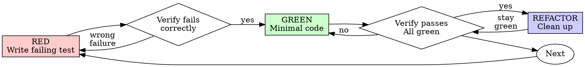

# Test-Driven Development (TDD)

## Overview

Write the test first. Watch it fail. Write minimal code to pass.

**Core principle:** If you didn't watch the test fail, you don't know if it tests the right thing.

**Violating the letter of the rules is violating the spirit of the rules.**

## When to Use

**Always:**
- New features
- Bug fixes
- Refactoring
- Behavior changes

**Exceptions (ask your human partner):**
- Throwaway prototypes
- Generated code
- Configuration files

## The Iron Law

**No production code without a failing test first.**

Write code before the test? Delete it. Start over.

Implement fresh from tests — drive new code from the failing test, not from what was deleted.

## Red-Green-Refactor



### RED - Write Failing Test

Default to **Detroit/Chicago School TDD**: real collaborators, assertions on observable state — not on interactions.

Write one minimal test showing what should happen.

**Good test:** the name describes a specific, observable behavior (e.g. "retries failed operations 3 times"); the body drives the real implementation through real collaborators (Detroit/Chicago School); and the assertions check what the code returned or the observable state, not what intermediate steps were called.

**Bad test:** vague name (e.g. "retry works"); heavy test-double setup that pre-arranges the answer; assertions on interactions between collaborators rather than the result. You're testing your test scaffold, not the code.

**Requirements:**
- One behavior
- Clear name
- Detroit/Chicago School: real collaborators, state-based assertions

### Verify RED - Watch It Fail

**MANDATORY. Never skip.**

Run only the test you just wrote. Not the file, not the suite — just this test method.

```bash
vendor/bin/phpunit --filter testMethodName tests/Path/SomeTest.php
```

Confirm:
- Test fails (not errors)
- Failure message is expected
- Fails because feature missing (not typos)

**Test passes?** You're testing existing behavior. Fix test.

**Test errors?** Fix error, re-run until it fails correctly.

### GREEN - Minimal Code

Write simplest code to pass the test.

**Good implementation:** just enough to make the test pass — no optional parameters, no configuration knobs, no premature abstraction. If the test asks for "retry 3 times", hardcode 3.

**Bad implementation:** anticipates needs the test didn't ask for — optional retry counts, exponential backoff modes, callback hooks for each attempt. That's YAGNI in spirit, even before any of it gets implemented.

Don't add features, refactor other code, or "improve" beyond the test.

### Verify GREEN - Watch It Pass

**MANDATORY.**

Run only the test you just wrote. Not the file, not the suite.

```bash
vendor/bin/phpunit --filter testMethodName tests/Path/SomeTest.php
```

Confirm:
- Test passes
- Output pristine (no errors, warnings)

**Test fails?** Fix code, not test.

### REFACTOR - Clean Up

After green only:
- Remove duplication
- Improve names
- Extract helpers

Keep tests green. Don't add behavior.

### Repeat

Next failing test for next feature.

## Inner Loop Scope

During RED → GREEN → REFACTOR for a single cycle, run **only** the test you are driving. No other tests. No suite.

Full-suite verification is owned by `verification-before-completion`, run before commit or PR.

```bash
vendor/bin/phpunit --filter testMethodName tests/Path/SomeTest.php
```

The same single-test pattern applies to other runners: `pytest -k`, `jest -t`, `go test -run`.

## Good Tests

| Quality | Good | Bad |
|---------|------|-----|
| **Minimal** | One thing. "and" in name? Split it. | A name that joins multiple behaviors with "and" |
| **Clear** | Name describes behavior | A name like "test1" or "it works" |
| **Shows intent** | Demonstrates desired API | Obscures what code should do |

## Example: Bug Fix

**Bug:** empty email accepted by the registration form.

**RED** — write a test that submits the registration with an empty email and asserts the response carries a validation error like "Email required".

**Verify RED** — run `vendor/bin/phpunit` for that test. It should fail because the form returns no error (or returns one with a different message). Confirm the failure mode is "feature missing", not a typo or class-not-found.

**GREEN** — add the minimal validation: if the email is empty or whitespace-only, return a validation error with message "Email required". Nothing else.

**Verify GREEN** — run the test again. Confirm it passes.

**REFACTOR** — if you'll need validation for multiple fields, extract a small helper. Otherwise, leave it.

## Verification Checklist

Before marking work complete:

- [ ] Every new function/method has a test
- [ ] Watched each test fail before implementing
- [ ] Each test failed for expected reason (feature missing, not typo)
- [ ] Wrote minimal code to pass each test
- [ ] Your new test passes (inner loop)
- [ ] Full suite verified separately via verification-before-completion
- [ ] Output pristine (no errors, warnings)
- [ ] Tests follow Detroit/Chicago School (real collaborators, state-based)
- [ ] Edge cases and errors covered

Can't check all boxes? You skipped TDD. Start over.

## When Stuck

| Problem | Solution |
|---------|----------|
| Don't know how to test | Write wished-for API. Write assertion first. Ask your human partner. |
| Test too complicated | Design too complicated. Simplify interface. |
| Hard to test without faking every collaborator | Code too coupled. Use dependency injection or test at a higher boundary. |
| Test setup huge | Extract helpers. Still complex? Simplify design. |

## Debugging Integration

Bug found? Write failing test reproducing it. Follow TDD cycle. Test proves fix and prevents regression.

Never fix bugs without a test.

## Testing Anti-Patterns

If you must reach for test doubles (rare under Detroit/Chicago School), read @testing-anti-patterns.md to avoid common pitfalls:
- Testing test-double behavior instead of real behavior
- Adding test-only methods to production classes
- Substituting collaborators without understanding what they do

## Final Rule

**Production code → test exists and failed first. Otherwise → not TDD.**

No exceptions without your human partner's permission.
