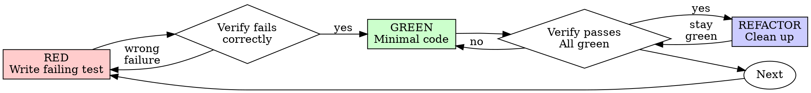

# Test-Driven Development (TDD)

## Overview

Write the test first. Watch it fail. Write minimal code to pass.

**Core principle:** Observe the expected failure to establish that the test detects the behavior you intend to change.

**Violating the letter of the rules is violating the spirit of the rules.**

## When to Use

**Always:**
- New features
- Bug fixes
- Refactoring
- Behavior changes

**Exceptions (ask your human partner):**
- Throwaway prototypes
- Generated code
- Configuration files

## The Iron Law

**Observe the focused test fail for the expected reason before writing production code.**

Write code before the test? Delete it. Start over.

Drive the fresh implementation from the failing test.

## Red-Green-Refactor


```dot
digraph tdd_cycle {
    rankdir=LR;
    red [label="RED\nWrite failing test", shape=box, style=filled, fillcolor="#ffcccc"];
    verify_red [label="Verify fails\ncorrectly", shape=diamond];
    green [label="GREEN\nMinimal code", shape=box, style=filled, fillcolor="#ccffcc"];
    verify_green [label="Verify passes\nAll green", shape=diamond];
    refactor [label="REFACTOR\nClean up", shape=box, style=filled, fillcolor="#ccccff"];
    next [label="Next", shape=ellipse];

    red -> verify_red;
    verify_red -> green [label="yes"];
    verify_red -> red [label="wrong\nfailure"];
    green -> verify_green;
    verify_green -> refactor [label="yes"];
    verify_green -> green [label="no"];
    refactor -> verify_green [label="stay\ngreen"];
    verify_green -> next;
    next -> red;
}
```

### RED - Write Failing Test

Default to **Detroit/Chicago School TDD**: real collaborators and assertions on observable state.

Write one minimal test showing what should happen.

**Good test:** the name describes a specific, observable behavior (e.g. "retries failed operations 3 times"); the body drives the real implementation through real collaborators (Detroit/Chicago School); and the assertions check what the code returned or the observable state.

**Bad test:** vague name (e.g. "retry works"); heavy test-double setup that pre-arranges the answer; assertions on interactions between collaborators rather than the result. You're testing your test scaffold, not the code.

**Requirements:**
- One behavior
- Clear name
- Detroit/Chicago School: real collaborators, state-based assertions

### Verify RED - Watch It Fail

**MANDATORY.**

Run the single test method you just wrote.

```bash
vendor/bin/phpunit --filter testMethodName tests/Path/SomeTest.php
```

Confirm:
- The assertion fails for the expected behavioral reason
- Failure message is expected
- The failure demonstrates the missing behavior

**Test passes?** You're testing existing behavior. Fix test.

**Test errors?** Fix error, re-run until it fails correctly.

### GREEN - Minimal Code

Write simplest code to pass the test.

**Good implementation:** just enough to make the test pass. If the test asks for "retry 3 times", hardcode 3.

**Bad implementation:** anticipates needs the test didn't ask for — optional retry counts, exponential backoff modes, callback hooks for each attempt. That's YAGNI in spirit, even before any of it gets implemented.

Keep this increment scoped to the behavior exercised by the test.

### Verify GREEN - Watch It Pass

**MANDATORY.**

Run the single test method you just wrote.

```bash
vendor/bin/phpunit --filter testMethodName tests/Path/SomeTest.php
```

Confirm:
- Test passes
- Output pristine (no errors, warnings)

**Test fails?** Correct the implementation to satisfy the expected behavior.

### REFACTOR - Clean Up

After green only:
- Remove duplication
- Improve names
- Extract helpers

Preserve behavior and keep the focused test green during refactoring.

### Repeat

Next failing test for next feature.

## Inner Loop Scope

During RED → GREEN → REFACTOR for a single cycle, run the single test you are driving.

Implement the approved behavior through small increments, each with its own focused test.

At task completion, run the focused tests and checks relevant to the task's owned behavior and affected surface. Broader repository coverage belongs to CI.

```bash
vendor/bin/phpunit --filter testMethodName tests/Path/SomeTest.php
```

The same single-test pattern applies to other runners: `pytest -k`, `jest -t`, `go test -run`.

## Good Tests

| Quality | Good | Bad |
|---------|------|-----|
| **Minimal** | One thing. "and" in name? Split it. | A name that joins multiple behaviors with "and" |
| **Clear** | Name describes behavior | A name like "test1" or "it works" |
| **Shows intent** | Demonstrates desired API | Obscures what code should do |

## Example: Bug Fix

**Bug:** empty email accepted by the registration form.

**RED** — write a test that submits the registration with an empty email and asserts the response carries a validation error like "Email required".

**Verify RED** — run `vendor/bin/phpunit` for that test. It should fail because the form returns no error (or returns one with a different message). Confirm the assertion fails because the expected validation is missing.

**GREEN** — add the minimal validation: if the email is empty or whitespace-only, return a validation error with message "Email required".

**Verify GREEN** — run the test again. Confirm it passes.

**REFACTOR** — if you'll need validation for multiple fields, extract a small helper. Otherwise, leave it.

## Verification Checklist

Before marking work complete:

- [ ] Every new or changed behavior has test coverage
- [ ] Watched each test fail before implementing
- [ ] Each test failed for the expected behavioral reason
- [ ] Wrote minimal code to pass each test
- [ ] Your new test passes (inner loop)
- [ ] Focused task-relevant verification run at the end of implementation
- [ ] Output pristine (no errors, warnings)
- [ ] Tests follow Detroit/Chicago School (real collaborators, state-based)
- [ ] Edge cases and errors covered

Complete each outstanding applicable check before reporting verification complete.

## When Stuck

| Problem | Solution |
|---------|----------|
| Don't know how to test | Write wished-for API. Write assertion first. Ask your human partner. |
| Test too complicated | Design too complicated. Simplify interface. |
| Hard to test without faking every collaborator | Code too coupled. Use dependency injection or test at a higher boundary. |
| Test setup huge | Extract helpers. Still complex? Simplify design. |

## Debugging Integration

Bug found? Write failing test reproducing it. Follow TDD cycle. Test proves fix and prevents regression.


## Testing Anti-Patterns

If you must reach for test doubles (rare under Detroit/Chicago School), read [testing-anti-patterns.md](testing-anti-patterns.md) to avoid common pitfalls:
- Testing test-double behavior instead of real behavior
- Adding test-only methods to production classes
- Substituting collaborators without understanding what they do

## Final Rule

**Each production change follows an observed failing test for its intended behavior.**

Agree exceptions with your human partner before proceeding.
