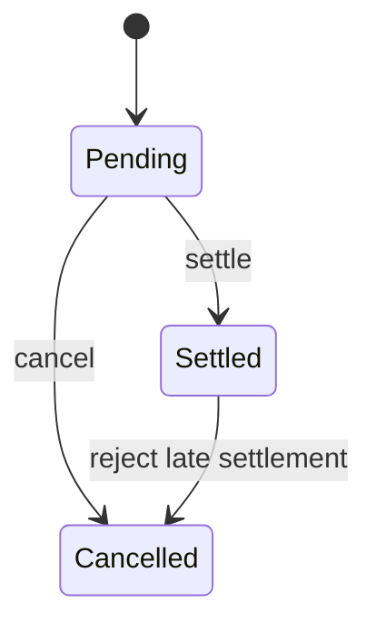

# Decision-Effort Writing Fixtures

These fixtures preserve the observed failure and the desired transfer rule. They
are a clean-replay oracle, not text to copy into a production PR.

## Rejected: outcome-first adds work

```md
## Motivation

Give a customer who retries after correcting an external record a fresh decision.
The retry currently reuses the rejected record that caused the retry.

### Previous flow
[before diagram]

### New flow
[after diagram]
```

The reader has to infer the actual failure from “fresh decision,” then inspect
two diagrams that do not change the review decision.

## Accepted: causal Motivation

```md
## Motivation

After a customer corrects an external record, retrying reuses the cached rejected result.
The retry cannot observe the correction and can turn a recoverable case into a decline.
```

The first sentence names the trigger and failure. The second names the customer
consequence. No visual is needed to decide what to inspect.

## Counterexample: diagram earns its place

````md
## Motivation

An account can move from pending to settled through two asynchronous processors.
The change adds a cancellation path that can race either processor.

### State transitions


````

The diagram is warranted because the review decision depends on concurrent
transitions that prose would make the reader reconstruct.

## Accepted: terse review reply

```md
Keep the cached-error guard. Retrying a non-frozen terminal error must reuse its
cached result; otherwise it makes an unnecessary second request.
```

This is adjacent evidence only: inline comments and replies remain outside the
shared narrative rule's scope.
